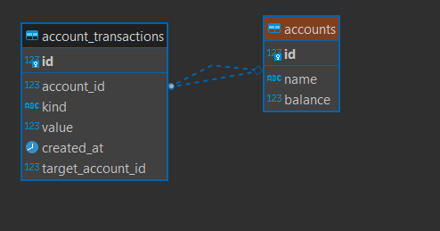

## Sistema de Transações Bancárias com Concorrência de Saldo - Grupo Primo

#### Autor

- [Israel Morais](https://www.linkedin.com/in/israel-morais-a3b20b173/)

## Descrição

Api para operações bancárias com concorrência

### Solução p/ concorrência

Para lidar com a concorrência e garantir ACID neste sistema foi utilizado os mecanismos de LOCK e TRANSACTION do Postgres.

Em cada transação o sistema realiza um LOCK no registro account e todas as transações concorrentes que desejam alterar o mesmo registro aguardam o LOCK. Quando a transação completa (seja sucesso ou falha) o LOCK é liberado e as transações seguintes repetem o processo.

O esquema DDL ficou assim:



### Principais Ferramentas

- Linguagem:

  - Typescript / Node.js

- Frameworks/Libs:

  - NestJS
  - Typeorm
  - Swagger / OpenAPI

- Banco de dados:

  - Postgres

- Conteinerização

  - Docker
  - Docker Compose

- Padrões
  - Monorepo
  - SOLID

## Pré requisitos

Para rodar o projeto deverá possuir o Node.js e o Docker Compose instalado.

## Como rodar

Clonar o repositório

```bash
git clone https://github.com/israel-bruno/grupo-primo-backend-test.git
```

Acessar a pasta do projeto

```bash
cd grupo-primo-backend-test
```

Executar o Docker Compose

```bash
docker-compose --env-file=.env.example up -d
```

## Como testar

Acessar a documentação dos endpoints:

[Documentação](http://localhost:3000/api/docs)

Acessar logs da aplicação:

```bash
docker-compose --env-file=.env.example logs -f app
```

Rodar testes unitários

```bash
docker-compose --env-file=.env.example exec app npm run test
```

Rodar testes e2e - (Estes contém os cenários de concorrência)

```bash
docker-compose --env-file=.env.example exec app npm run test:e2e
```
